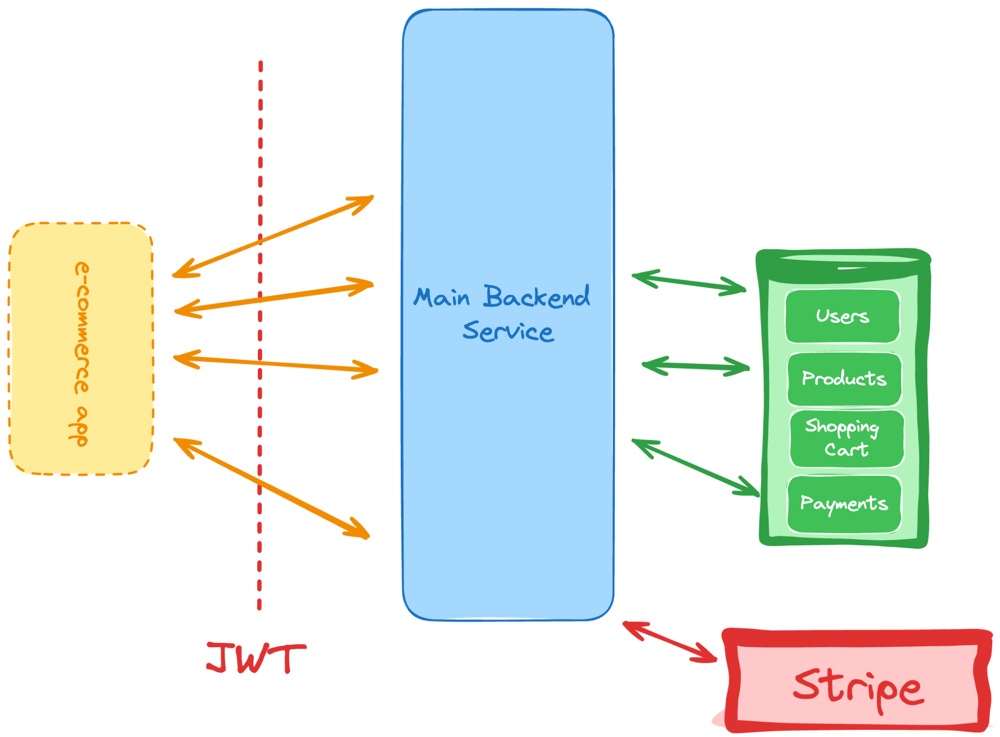

You are required to build an API for an e-commerce platform. If you have developed the other projects in this roadmap, you will have to keep in mind everything you have learned so far:

JWT authentication to ensure many users can interact with it.
Implementing simple CRUD operations.
Interaction with external services. Here you’ll be integrating with payment gateways such as Stripe.
A complex data model that can handle products, shopping carts, and more.
The goal of this project is to help you understand how to build a logic-heavy application with complex data models. You will also learn how to interact with external services and handle user authentication.

E-Commerce API

Requirements
Here is a rough list of requirements for this project:

Ability for users to sign up and log in.
Ability to add products to a cart.
Ability to remove products from a cart.
Ability to view and search for products.
Ability for users to checkout and pay for products.
You should also have some sort of admin panel where only you can add products, set the prices, manage inventory, and more.